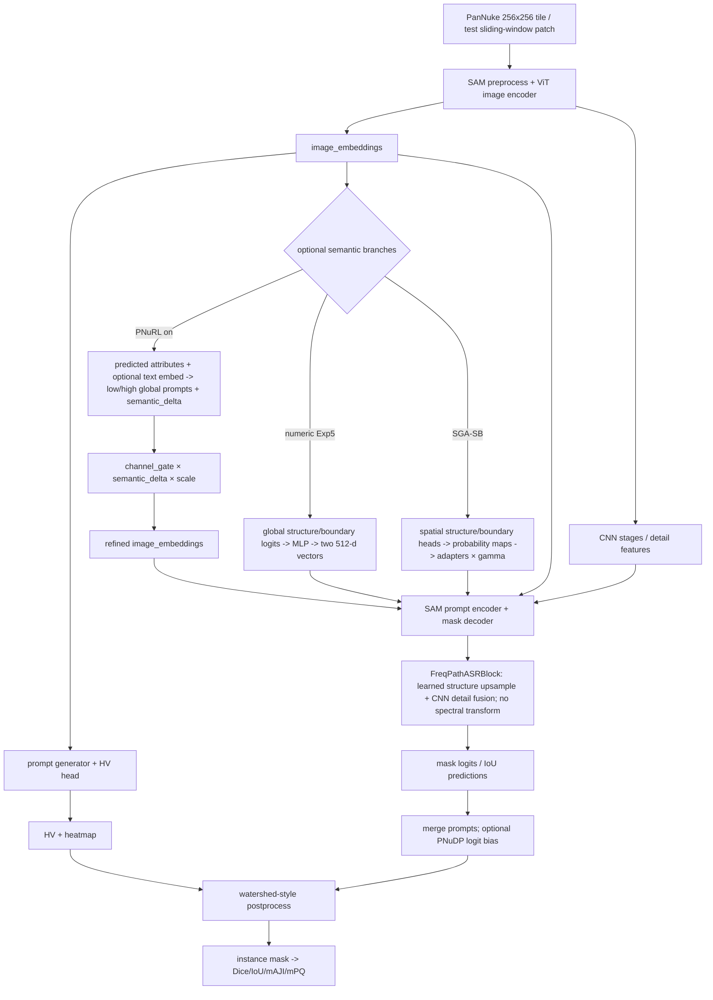
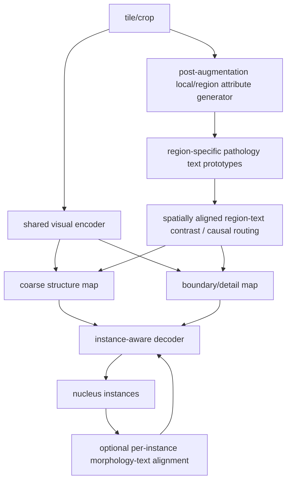

# NuSeg 项目综合审计（2026-07-22）

## 审计边界与算力

- 任务类型：纯 CPU 静态审计
- GPU：不需要，未使用，禁止占用 GPU
- 推荐 CPU：4–8 核；推荐内存：16–32 GB；预计峰值内存：低于 8 GB
- 磁盘操作：只读取证；未全量加载或重新哈希大型 checkpoint
- 对当前训练影响：无；进程快照未发现活动 `train.py`/`torchrun`
- 项目根目录：`/hy-tmp/NuSeg`
- Git：仓库根目录无 `.git`，branch/commit/status 均 `UNKNOWN`；不能证明当前源码对应任何提交
- 环境：当前 shell 无 Conda 环境名；Python 3.11.14，PyTorch 2.9.1+cu128，编译 CUDA 12.8（只读版本查询，未初始化/使用 GPU）
- 限制：未训练、未 full test、未加载完整数据集、未修改源码/配置/现有证据；只新建 `audit_20260722/`

## 开头直接回答 18 个问题

1. **一句话定义**：这是一个以 SamMed2D/SAM ViT-B、CNN/HV 辅助分支和 FreqPath decoder 为视觉底座，在 PanNuke 256×256 tile 上研究数值属性、文本语义及空间结构/边界引导的核实例分割工程原型。
2. **真正实现的核心方法**：视觉特征经 SAM encoder、prompt generator、mask decoder 与 HV 后处理；可选的预测属性或 PNuRL 文本语义以全局向量调制 decoder，SGA-SB 则由空间结构/边界预测图产生残差并注入对应 decoder 路径。
3. **最有价值的创新点**：结构语义与边界语义分路、并尝试把全局向量升级为空间可变引导；但目前最可信的正增益来自**无文本的数值属性路由**，不是文本创新。
4. **创新是否验证**：数值属性路由得到单种子同流程 full-test 支持；CONCH、双路语义、SGA-SB、PNuDP Dense、L1-A 均未达到因果或推进门槛。
5. **最佳可信结果**：Exp5 best-PQ checkpoint、canonical 单 GPU full test：Dice 0.8172、IoU 0.7048、mAJI 0.6361、mPQ 0.6094；同流程视觉基线为 0.8089/约 0.696–0.697/0.6270/0.6034。
6. **不可直接比较**：所有 train validation（40%/rank-local）、Exp6 无正式 full-test 日志的历史数字、SGA-SB/P4.1/L1-A validation、不同阈值/滑窗/语义设置/选择规则下结果。
7. **效果主要来自哪里**：现有证据只支持“预测数值属性路由 + 继续训练的整体配置”有效；无法拆分 decoder 继续训练、参数量、父 checkpoint、重初始化与属性路由的贡献。
8. **CONCH 是否有效**：未证明；Exp6 与 Exp5 同时改变父 checkpoint、PNuRL、alignment、PG3、优化器和参数量，且缺正式 full-test 证据。
9. **推理语义是否活跃**：取决于命令。`use_pnurl=True` 时 residual 语义仍可活跃；test 默认只关闭训练型 attr alignment/PromptNu-lite loss。视觉基线和 Exp5 canonical 日志显示 PNuRL semantic delta 未激活；Exp5 使用数值属性 low/high 路由。
10. **文本是否过于全局**：是。现有主文本是一 tile/patch 一个向量；无法定位粘连、小核或困难边界。L0 的五个核心属性局部/全局类别不一致率约 0.265–0.363。
11. **low/high 是否真实频域**：否。`FreqPathASRBlock` 只有转置卷积、卷积、MLP、门控和残差；未发现 FFT/DCT/滤波器组/显式频带分解。准确措辞应为“structure/detail semantic routing”或“coarse-structure and boundary-detail pathways”。
12. **PNuDP Dense 是否主线**：否；代码和短程审计存在，但没有保留正式 checkpoint/full test，应作为辅助/诊断分支。
13. **SGA-SB 完成度**：forward、loss、阶段解冻、optimizer、checkpoint、5 组单种子 E5 validation 均完成；无 full test/多种子，且固定 E5 无组同时超过 N0 的 mAJI 与 mPQ。
14. **L1-A/P4.1 为何失败**：L1-A E5 `ΔmAJI=-0.001001 < +0.003`；P4.1 soft-boundary 相对 legacy G2 在 E5 mAJI/mPQ 分别下降约 0.00657/0.00576，全部推进项失败。
15. **是否继续现有路线训练**：不应继续盲目扩大现有全局文本/SGA/P4.1训练；先重构问题表述和因果协议。
16. **下一项最小关键实验**：固定 Exp5 父 checkpoint、训练参数和 canonical full-test，比较 local-region correct text / shuffled-region text / frozen-random prototypes / no-local-loss，先单种子筛选，再 3 种子确认。
17. **能否支撑投稿**：当前不能支撑可信方法论文；有工程资产和一项单种子正结果，但缺多种子、因果消融、严格 full-test 和版本封存。
18. **现实定位**：工程原型；若局部语义因果成立，可成为普通应用创新或有潜力的方法论文。当前不宜声称 CCF-B/MICCAI/AAAI/CVPR 级贡献已经成立。

## 证据制度

状态使用 `VERIFIED/SUPPORTED/CLAIMED_ONLY/CONTRADICTED/UNKNOWN`。A=代码调用链+配置/命令+正式结果；B=代码+配置但缺正式结果；C=文档声称；D=计划/推测。完整逐项证据见 `PROJECT_EVIDENCE_LEDGER.tsv`。

## 当前真实 forward 路径



关键代码：`segment_anything/modeling/sam.py:4187-4265, 5707-5775, 6604-6651, 7182-7194, 7223-7293`；`segment_anything/modeling/mask_decoder.py:323-421, 827-876`；`segment_anything/modeling/pnurl.py:485-527, 719-763`。

### 真实公式与日志字段

- PNuRL semantic delta：`delta = tanh(projector(conditioned_feature)) × RMS(base) × bounded_ratio × residual_scale`（`pnurl.py:503-527`）。
- 默认注入：`injected_delta = channel_gate × semantic_delta × semantic_injection_scale`；`refined = image_embeddings + injected_delta`（`sam.py:4131-4150`）。
- `GateMean/Min/Max`：实际 gate 全元素统计；`DeltaNorm`：每样本通道 L2 norm 后空间均值；`InjectedNorm` 同理；`InjRatio=InjectedNorm/(BaseNorm+1e-6)`；`DeltaRatio` 是 adapter 预测的 RMS 比例参数，不是 `DeltaNorm/BaseNorm`（`train.py:3243-3364`）。
- FreqPath low：全局 512-d attr vector 经 MLP 产生通道方向，再由视觉特征产生空间 gate；high：全局 morphology vector 调制 CNN detail feature。两者是语义角色，不是物理频率。
- SGA-SB：`structure_delta=gamma_structure×adapter(sigmoid(structure_logits))`，注入第一个结构路径；boundary 同理注入第二个 CNN/detail 路径（`sam.py:4248-4265, 6604-6619`; `mask_decoder.py:850-876`）。
- PNuDP Dense：`fused_logits = base_logits.float() + alpha × eval_scale × bias.float()`（`sam.py:7223-7293`）。

## 论文设想的目标方法路径



差异：当前主路是全局向量，目标路应是空间对齐 map；当前 instance morphology 训练依赖 GT instance masks，推理没有逐核文本一一对应；L1-A 仅辅助 loss、明确不注入分割特征；当前“frequency”没有显式谱操作；缺 correct-vs-shuffled 语义因果门槛。

## 数据与语义粒度

- PanNuke 原始单位是 256×256 tile，不是 WSI。训练 `RandomCrop(256)` 后翻转/旋转，再 resize 512；当前数据因 tile=256，crop 不裁内容（`DataLoader.py:1584-1630, 1766-1807`；L0 JSON 全 4,946 train tiles）。
- organ/sample 文本和预计算结构/边界 JSON 都是一 tile 一记录；同一 tile 内所有自动 prompt/局部核共享全局向量。
- `dynamic_gt` 在 crop 后用 GT mask 重新算属性，但 val/test 被硬回退为 organ_static，避免直接 GT 泄漏（`DataLoader.py:1368-1374, 1829-1875`）。
- val/test 默认用 train-split organ prior，不消费样本级 GT v2 属性（`DataLoader.py:1384-1390, 1886-1899`）。
- per-instance morphology 标签在增强后按 instance ID 重算；Phase C 可做每实例对齐，但推理无 GT instance mask/逐实例文本，故不是完整 instance-level inference。
- L1-A 在增强后 mask 上重算四个 192×192 region 标签，ROI 对应 32×32 encoder feature 上 24×24 区域；只训练五个 projector，`feature_injection=False`，eval 严禁 local GT（`training/local_region_text_alignment.py:184-289, 306-425`）。
- L0 实证：density、size heterogeneity、crowding、boundary irregularity、elongation 的局部/全局类别不一致约 26.5%、36.3%、27.5%、31.3%、28.9%，支持“粒度错配是主要问题”而非“编码器不够强”。

## 实验可信度与核心结果

### 唯一可信直接比较组（canonical full test，单种子）

| Run | Checkpoint | Text/semantic | Dice | IoU | mAJI | mPQ | 结论 |
|---|---|---|---:|---:|---:|---:|---|
| Visual baseline | `Visual_baseline/best_model.pth` | PNuRL off | 0.8089 | 约0.696–0.697 | 0.6270 | 0.6034 | 基线 |
| Exp5 | `exp5.../best_pq_model.pth` | no CONCH; predicted numeric attrs | 0.8172 | 0.7048 | 0.6361 | 0.6094 | +0.0091 mAJI，+0.0060 mPQ |

证据：`workdir/audits/p0_20260713/*full_test_1gpu.log` 的 `FULL_COMMAND` 与 Final Results。两者相同 test 数据、512 image、256 patch、0.8 overlap、0.40/0.45/12 后处理、FreqPath both、无 SGA。仍仅 seed 42，且 Exp5 相对 baseline 有父 checkpoint/训练阶段/额外参数/继续训练混杂，故只证明“Exp5 整体配方”，不证明属性的独立因果。

### 重要但不可直接比较

- Exp6：正式 10 epoch 训练存在；CONCH/PNuRL/PG3 确实启用，但历史 full-test 数字没有日志/结果文件，标记 `CLAIMED_ONLY`。与 Exp5 的父 checkpoint和可训练模块均不同，不能做 CONCH 因果结论。
- Phase B/Phase C：checkpoint 存在，optimizer 代码明确；属性 warmup/alignment 完成只证明辅助任务，不证明 segmentation。
- SGA-SB P3：N0/S1/G1/G2/G3 同协议单种子 5 epoch validation。固定 E5 相对 N0：G2 mAJI +0.000926、mPQ -0.002541；其余指导更差；推进失败。
- P4.1：soft boundary 相对 legacy G2 E5 mAJI -0.006571、mPQ -0.005762，E4–5 mean 也下降；停止合理。
- L1-A：local loss、梯度和数据门槛通过，但 E5 mAJI 比 matched C0 低 0.001001；无 shuffle/random 因果实验；停止向 L2 推进合理。
- PNuDP Dense：只有 smoke/20-batch/1-epoch traces，无保留正式 checkpoint/full test。

## 指标与测试实现审计

- mAJI：逐图 Hungarian 最大 intersection 配对后聚合 matched union 与未匹配面积（`metrics.py:7-98`）。这是项目实现，应在论文中明确，不应默认为所有文献的 AJI+。
- mPQ：IoU `>0.5` 匹配，`PQ=DQ×SQ`（`metrics.py:100-160`）。严格大于而非大于等于。
- `SegMetrics` 先逐样本计算再 batch mean（`metrics.py:162-262`）。
- full test DDP：每 rank 累加每样本指标与计数，再 all-reduce sum/count，逻辑正确（`test.py:2167-2309`）；但 `DistributedSampler(drop_last=False)` 在样本数不整除 world size 时会补齐重复样本，代码未去重，是条件性风险。
- train validation：默认每 rank 只跑其 dataloader 的 40%，没有 all-reduce，rank0 用本地均值保存 best checkpoint（`train.py:4862-5072`）。这是高风险：validation 与 checkpoint selection 在 DDP 下不是全局统计。
- train val 固定后处理 0.45/0.40/10；full test 默认 0.40/0.45/12 且滑窗 0.8。因此两者不可比较。
- dynamic_pred 是两阶段 predicted-attribute prompt，不使用 test GT；dynamic_gt 被 test CLI 排除。公平性仍要求相同两阶段计算与后处理成本。

## 因果性判定

| 主张 | 判定 | 原因 |
|---|---|---|
| Exp5 整体优于视觉 baseline | 部分支持 | 同流程 full test，但单种子且训练混杂 |
| 数值属性本身造成提升 | 尚未证明 | 缺 same-params/no-attr、shuffled attrs、random route |
| CONCH 优于 no-text/CLIP | 尚未证明 | 无严格配对 full test；CLIP Exp7 无正式证据 |
| 正确文本语义被模型使用 | 尚未证明 | 缺 shuffled/random/wrong-pairing；L1-A 未过门槛 |
| SGA-SB 空间注入可训练 | 已证明 | forward、梯度、gamma/delta 日志齐全 |
| SGA-SB 提升实例分割 | 目前被单种子 validation 反证/不支持 | 无组同时改善 E5 mAJI、mPQ |
| frequency-aware | 代码层面被反证 | 没有显式频谱操作 |
| PNuDP Dense 是核心贡献 | 尚未证明 | smoke-only，无正式 checkpoint/full test |

## 代码健康度

高风险：

1. 无 Git 元数据，无法把结果绑定到 commit；源码含 `.p3_pre/.p3_2_pre` 和大量兼容分支，复现版本不可唯一确定。
2. DDP validation 未全局聚合，却用于 best checkpoint；可能产生 rank-local 选择偏差。
3. `resume_filter_mismatch` 会静默跳过 shape mismatch 后以 `strict=False` 加载；虽有日志，但未统一把关键新模块缺失设为 fatal，存在随机初始化进入正式实验风险。
4. 语义实验改变多组 trainable 参数和父 checkpoint，无法归因。

中风险：

1. train/test 后处理默认不一致；历史指标极易误比。
2. `DistributedSampler` full test 在不能整除时重复样本。
3. test 的 `--disable_attr_text_alignment_forward_in_test` 使用 `store_true, default=True`，CLI 无法关闭；语义 residual 并未因此关闭，但接口表达混乱。
4. 许多环境变量（`FREQPATH_ABLATION` 等）不进入 checkpoint 完整 args，血缘不全。
5. `.env` 存在且未读取；秘密管理风险需人工检查，报告不输出内容。

低风险：日志命名混用 “frequency/structure/detail”；`DeltaRatio` 与 norm ratio 含义不同；旧 PromptNu/PNuDP 分支和备份源码增加维护复杂度。

## 完成度总评（0–5）

| 维度 | 分数 | 说明 |
|---|---:|---|
| 工程完成度 | 3 | 多分支可训练，有正式 runs；缺版本封存 |
| 数据链路 | 4 | PanNuke、实例/HV/属性/local target 齐全；test lineage 仍需冻结 |
| 视觉基线 | 4 | canonical full test 已复核；缺多种子 |
| 属性监督 | 3 | Phase B checkpoint/训练存在；正式指标元数据不完整 |
| 文本语义 | 3 | CONCH/cache/alignment/PG3 可跑；无因果支持 |
| 推理语义 | 2 | 多种路径可激活；正式可比结果不足 |
| 主线消融 | 2 | SGA N0/S1/G1/G2/G3 有 validation；FreqPath low/high/both full test 不全 |
| 因果验证 | 1 | 缺 shuffled/random/wrong-pair/same-param |
| 多种子复现 | 0 | 核心结论均未见多种子 |
| 论文写作准备 | 1 | 可写工程/负结果报告，不能支撑方法主张 |

## 创新与相关工作保守判断

- PromptNu（Yao et al., IEEE TMI 2025, DOI 10.1109/TMI.2025.3579214）用多面核知识 prompt、视觉语言对齐与 prompt engineering；当前项目的 residual injection/structure-boundary routing 是实现差异，但尚无因果证据。
- WeaveSeg（Li, Wu, Qin, ICCV 2025）明确做 adaptive spectral component fusion；本项目没有谱操作，不能借用同等“spectral/frequency-aware”表述。[官方页面](https://openaccess.thecvf.com/content/ICCV2025/html/Li_WeaveSeg_Iterative_Contrast-weaving_and_Spectral_Feature-refining_for_Nuclei_Instance_Segmentation_ICCV_2025_paper.html)
- CONCH 是 2024 Nature Medicine 病理 VLM，本项目只是使用外部文本 encoder/cache，不构成创新。[论文](https://www.nature.com/articles/s41591-024-02856-4)
- IVAAN（Jeong et al., CVPR 2026）已探索 attribute-guided text 与 instance-level representation；当前若转 instance route，需要强调核实例一一对应、分割而非分类，以及严格预测时语义来源。[官方论文](https://openaccess.thecvf.com/content/CVPR2026/papers/Jeong_IVAAN_Instance-level_Vision-Language_Alignment_via_Attribute-Guided_Text_Prompts_Generation_for_CVPR_2026_paper.pdf)
- DyKo（Li et al., CVPR 2026）把通用知识实例化为 slide-specific patch guidance，说明静态全局描述的风险已成为明确研究问题；任务是 WSI few-shot classification，不与本项目直接重复。[官方页面](https://openaccess.thecvf.com/content/CVPR2026/html/Li_Universal-to-Specific_Dynamic_Knowledge-Guided_Multiple_Instance_Learning_for_Few-Shot_Whole_Slide_CVPR_2026_paper.html)
- MLLM-HWSI（Alawode et al., CVPR 2026）按 cell/patch/region/WSI 四层对齐，强化粒度一致性动机，但任务规模与目标不同。[官方论文](https://openaccess.thecvf.com/content/CVPR2026/papers/Alawode_MLLM-HWSI_A_Multimodal_Large_Language_Model_for_Hierarchical_Whole_Slide_CVPR_2026_paper.pdf)

保守结论：目前不是已成立的 frequency-aware 方法，也不是已证明的 CONCH 方法；是“视觉底座 + 数值/文本属性路由 + 空间结构边界实验”的工程原型。

## 论文还缺什么

1. 封存可追溯 Git commit、依赖、数据 manifest、唯一训练/测试配置。
2. 修正或规避 DDP validation 选择偏差，并统一 canonical full-test。
3. 3 个以上随机种子，报告 mean±std；冻结 checkpoint 选择规则。
4. same-parameter 因果组：correct/shuffled/random/no-text/no-delta/no-gate/decoder-only。
5. low/high/both/none 在相同父 checkpoint、相同训练预算、相同 full-test 下比较。
6. 局部/实例语义必须在推理端有非 GT 的一致来源；不能只增加训练 loss。
7. 改名：除非新增并验证真实频谱分解，否则使用 structure/detail 或 coarse/boundary routing。

## 路线决策与算力

首选路线 B：局部区域语义，复用 L0/L1-A target、prototype bank、ROI pooling 和 Exp5 底座；最小新增是把 region evidence 与空间 feature 绑定，并设计 correct-vs-shuffled 因果测试。路线 A 暂停扩大训练，只保留为固定对照；路线 C（instance-level）潜力高但工程/匹配风险更大，待 B 证伪或成功后再进。

最小实验资源：非纯 CPU；2×24 GB GPU（当前 2×RTX 5090 配置可用但非必须）；单卡建议 ≥24 GB；预计峰值约 16–19 GB/卡（参考 L1-A/SGA 记录）；4 个单种子筛选组约 4×5 epoch，按已有每组约 45–55 分钟，合计约 7–10 GPU-hours；不与当前训练并行（审计时未检测到活动训练）。筛选失败即停；成功后 3 seeds 的 correct/no-local/shuffled 三组约 20–30 GPU-hours。

推进门槛：

- `ADVANCE`：canonical same-test-pipeline full test，3 seeds mean mAJI 至少比 matched no-local 提升 +0.003，且 95% CI/配对结果稳定；mPQ 平均下降不超过 0.002；correct text 显著优于 shuffled/random；三组参数量、父 checkpoint、训练预算、后处理一致。
- `HOLD`：只有单种子/validation 小幅提升，或 correct 与 shuffled 差异不稳定。
- `STOP`：full-test mAJI 不超 matched baseline，或 shuffled/random 与 correct 无实质差别，或 mPQ 持续下降超过 0.002。

## 保留与冻结建议

- 保留/冻结：Visual baseline checkpoint+canonical log；Exp5 best-PQ checkpoint+canonical log；Phase B/Phase C checkpoints（血缘父节点）；SGA P3/P4.1 和 L0/L1-A 的日志、metrics_history、manifest 与负结果。
- 历史用途、不可作主结果：PromptNu-lite、Exp6、PNuDP Dense、旧 best/latest 混杂 checkpoint；在补齐唯一配置前标记 `LINEAGE_BROKEN/PARTIAL`。
- 不应再调：P4.1 soft target、PNuDP alpha/后处理 sweep、CONCH/CLIP backend、semantic gate 强度；先回答 correct semantics 是否被使用。

## 冲突记录

1. 旧文档曾将 baseline/Exp5 full-test 标为用户提供且未验证；2026-07-13 canonical 日志已补齐，现升级为 VERIFIED。
2. Exp6 历史数字仍无正式 full-test 文件，不能升级。
3. 文档“frequency-aware”与代码无频谱算子冲突；代码优先，判定 CONTRADICTED。
4. SGA-SB “机制接入成功”与“性能有效”不矛盾：前者 VERIFIED，后者未通过门槛。
5. L0 支持局部粒度存在信息差，而 L1-A E5 失败：说明动机成立但当前 supervision-only 实现无足够分割收益。

## 已完成 / 已实现未证明 / 未完成

- 已完成且不应重复：PanNuke 目标生成、Visual/Exp5 canonical full test、SGA P3 对照、P4.1 负结果、L0 全 train 粒度审计、L1-A matched C0/L1。
- 已实现未证明：CONCH/CLIP、PNuRL residual、PromptNu-lite/PG3、PNuDP Dense、SGA-SB 分割收益、instance alignment。
- 未完成/证据不足：核心三种子、correct-vs-shuffled、same-parameter/no-text、low/high/both canonical full test、全局 DDP validation、Git 可追溯版本、论文级统计。

## 最终结论

```text
[FINAL_PROJECT_VERDICT]

ProjectDefinition:
SAM/SamMed2D 视觉底座上的 PanNuke 核实例分割工程原型，研究数值/文本属性与空间结构-边界引导。

EngineeringStatus:
主要路径均已实现并多次训练，但无 Git 元数据、兼容分支多，复现版本未封存。

ExperimentalStatus:
Exp5 有单种子 canonical full-test 正结果；语义、SGA-SB、P4.1、L1-A 未过论文级门槛。

InnovationStatus:
结构/边界分路有潜力，但 frequency-aware 与 CONCH 有效性均未成立。

SemanticGranularityStatus:
全局文本与局部分割错配有 L0 数据支持；当前 L1-A supervision-only 未产生足够 mAJI 增益。

BestTrustedResult:
Exp5: Dice 0.8172, IoU 0.7048, mAJI 0.6361, mPQ 0.6094（单种子 canonical full test）。

MainUnprovenClaim:
正确的结构/边界文本语义，而非继续训练或额外参数，能提高核实例分割。

MainTechnicalRisk:
DDP validation 未全局聚合且 checkpoint/环境参数血缘不完整。

MainResearchRisk:
语义粒度错配与缺失 shuffled/random 因果对照导致方法可忽略文本。

RecommendedMainRoute:
局部区域语义对齐与空间路由（路线 B），先做最小可证伪实验。

ExperimentsToStop:
暂停 P4.1、PNuDP 参数扫、CONCH/CLIP换底座及全局文本 gate 微调。

NextMinimalFalsifiableExperiment:
matched Exp5 上 correct local text vs shuffled local text vs random prototype vs no-local，固定其他变量并做 canonical full test。

AdvanceGate:
3 seeds mean mAJI +0.003，mPQ 不低于 -0.002，且 correct 显著优于 shuffled/random。

PaperReadiness:
当前不足以投稿可信方法论文；完成版本封存、因果消融、多种子 full test 后再评估。

FINAL_DECISION:
RESTRUCTURE
```
